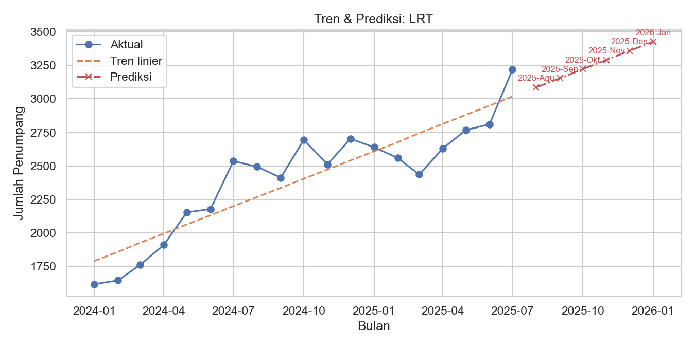
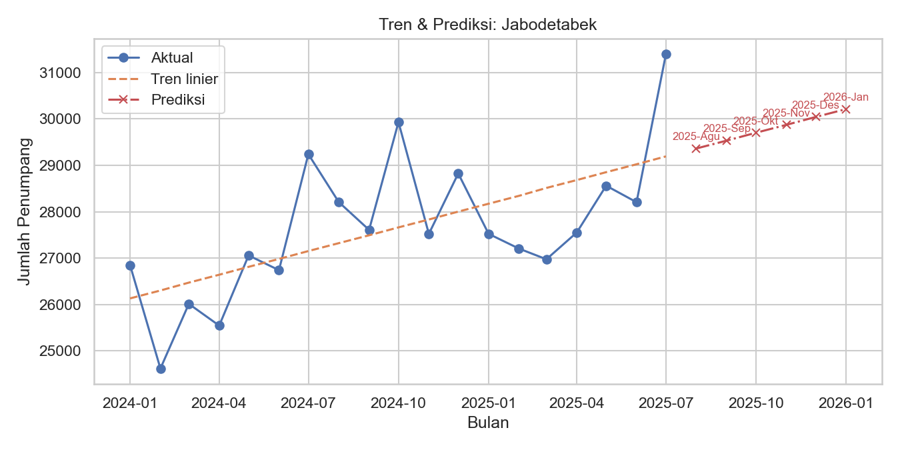
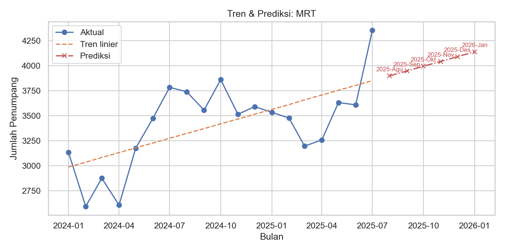

# Railway Passenger Forecasting (Indonesia) — Bilingual README

Table of Contents

- English
  - Overview
  - Business Context
  - Data Source
  - Project Structure
  - Environment Setup
  - How to Run
  - Outputs
  - Methodology
  - Summary Table (EN)
  - 2025-end Key Results (EN)
  - FAQ
  - License
- Bahasa Indonesia
  - Proyek Data Sains: Prediksi Jumlah Penumpang Kereta Api (Indonesia, 2025)
  - Konteks Bisnis
  - Sumber Data
  - Struktur Proyek
  - Persiapan Lingkungan
  - Menjalankan
  - Keluaran
  - Metodologi Singkat
  - Tabel Ringkasan (ID)
  - hasil-analisis-2025-akhir
  - FAQ
  - Lisensi

## English

## Data Science Project: Forecasting Railway Passenger Numbers (Indonesia, 2025)

This project summarizes short-term trends and forecasts (1–3 months ahead) of railway passenger numbers per category using a simple linear trend model.

## Business Context

Forecasting railway passenger numbers is essential for capacity planning, resource allocation, and revenue strategy. This project provides a quick view of short-term trends as a basis for operational decision-making.

## Data Source

Monthly historical data sourced from the Statistics Indonesia (BPS) public data portal:  
https://www.bps.go.id/id/statistics-table/2/NzIjMg==/jumlah-penumpang-kereta-api--ribu-orang-.html

The 2024 and 2025 CSV files in this repo are extracted/restructured into the following format for analysis:  
`vehicle type, January..December, Annual`

### Example Visual

Example of model output (category with high trend fit):  


## Summary Table (EN)

| Item          | Description                                                                                                                                              |
| ------------- | -------------------------------------------------------------------------------------------------------------------------------------------------------- |
| Objective     | Short-term forecasting of railway passengers by category using a simple linear trend                                                                     |
| Data Source   | BPS – https://www.bps.go.id/id/statistics-table/2/NzIjMg==/jumlah-penumpang-kereta-api--ribu-orang-.html                                                 |
| Period        | Historical Jan 2024 – Jul 2025 (combined 2024+2025); Forecast Aug 2025 – Jan 2026                                                                        |
| Method        | Linear Regression y = a + b·t (Python: pandas, numpy, scikit-learn; visualization: matplotlib, seaborn)                                                  |
| Outputs       | Table: [output_2024_2025/forecast_summary.csv](output_2024_2025/forecast_summary.csv), Charts: [output_2024_2025/plots/](output_2024_2025/plots/)        |
| How to Run    | `python src/forecast.py -i "Jumlah Penumpang Kereta Api, 2024.csv" -i "Jumlah Penumpang Kereta Api, 2025.csv" --horizon 6 --output_dir output_2024_2025` |
| Key Visuals   | , ,        |
| Key Takeaways | After the July-2025 peak, a correction in August 2025 is followed by a gradual upward trend; LRT shows the strongest consistency (R² ~ 0.81)             |

## Summary Answer

- Question: "Will the trend increase or decrease?"
- Short answer: based on the linear trend per category using combined 2024–Jul 2025 history, we project a dip in Aug-2025 after the Jul-2025 peak, followed by a gradual uptrend into early 2026. Per-category details are available in the summary output.
- Note: this is a simple linear trend model on monthly data; seasonality and policy shocks are not explicitly modeled.

## Project Structure

```
.
├─ README.md
├─ requirements.txt
├─ Jumlah Penumpang Kereta Api, 2024.csv
├─ Jumlah Penumpang Kereta Api, 2025.csv
└─ src/
   └─ forecast.py
```

## Environment Setup

It is recommended to use a virtual environment (Windows):

```

python -m venv .venv
.\.venv\Scripts\activate
pip install -r requirements.txt

```

If you already have an active environment, simply install dependencies:

```

pip install -r requirements.txt

```

Main dependencies:

- pandas, numpy
- scikit-learn
- matplotlib, seaborn

Minimum versions are not pinned; use the latest stable releases.

## Running

Example command (Windows, from project root):

```

python src/forecast.py --input "Jumlah Penumpang Kereta Api, 2024.csv" --horizon 3 --output_dir output

```

Arguments:

- `--input`: input CSV path (default: "Jumlah Penumpang Kereta Api, 2024.csv")
- `--horizon`: number of months ahead to forecast (default: 3)
- `--output_dir`: output folder (default: output)
- `--year`: year of the input CSV (default: 2024)

## Outputs

After running successfully, you will get:

1. **Summary file**: `output/forecast_summary.csv`
   Columns (English names with CSV field mapping):

   - category (CSV: `tipe_kendaraan`)
   - n_obs
   - last_month_actual
   - slope_per_bulan (monthly slope)
   - intercept
   - r2
   - direction vs last actual (CSV: `arah_prediksi_vs_bulan_terakhir`; up/down/flat; tolerance 0.5% or min 10)
   - pred_next_1 .. pred_next_H (forecasts)
   - pred_next_1_label .. pred_next_H_label (labels, e.g., 2025-Jan)

2. **Plots per category**: `output/plots/*.png`
   Showing:

   - actual values across the historical span (e.g., 2024–Jul 2025)
   - fitted linear trend line
   - forecasted points 1..H months ahead with month labels

3. **Console summary**
   The script also prints a summary table in the terminal.

## Methodology

- Data is read using `utf-8-sig` to handle BOM in the header.
- Data is reshaped from wide (month columns) to long time series (1 row per category-month).
- For each category, a linear regression model `y = a + b·t` (t = 1..12) is fit using `sklearn.linear_model.LinearRegression`.
- Forecasting is performed for t = n+1..n+H.
- Direction classification for the next month:
  - "up" if `pred_next_1` > `last_month_actual + tol`
  - "down" if `pred_next_1` < `last_month_actual - tol`
  - "flat" if within tolerance
  - Tolerance: `tol = max(0.5% * last_actual, 10)`

Limitations:

- Only 12 data points (1 year); seasonal or weekly patterns are not captured.
- Pure linear trend ignores long holidays, promotions, fare policies, or external shocks.
- For better accuracy with multi-year data, consider Holt-Winters/Exponential Smoothing, SARIMA, or Prophet.

## Quick Reproduction

1. Activate your virtualenv (Windows):

```

.\.venv\Scripts\activate

```

2. Install dependencies (if not already):

```

pip install -r requirements.txt

```

3. Run:

```

python src/forecast.py --input "Jumlah Penumpang Kereta Api, 2024.csv" --horizon 3 --output_dir output

```

4. Check:

- `output/forecast_summary.csv` for forecast values and direction
- `output/plots/*.png` for visualizations by category

## FAQ

- BOM in CSV file? Already handled (`utf-8-sig`), headers are cleaned automatically.
- Is the "Annual" column included? No, it is ignored when fitting.
- Can I change horizon? Yes, adjust `--horizon` (e.g., 1 or 6).
- Negative predictions? With pure linear trend, this may occur in strongly declining categories. Interpret carefully; consider adding constraints or alternative models.

## License

Free to use for internal analyses and educational purposes. Please add attribution if republished.

## Key Results End-2025 (EN)

Below is a concise summary table for three focus categories using combined 2024+2025 data (history Jan-2024–Jul-2025; forecast Aug-2025–Jan-2026).

| Category    | Jul-2025 (Actual) | 2025-Aug (Forecast) | Direction vs Last Month | 6-Month Trend |
| ----------- | ----------------: | ------------------: | ----------------------- | ------------- |
| Jabodetabek |            31,401 |           29,363.70 | down                    | gradual rise  |
| MRT         |             4,354 |            3,898.91 | down                    | gradual rise  |
| LRT         |             3,219 |            3,085.79 | down                    | steady rise   |

Key visuals: [jabodetabek.png](output_2024_2025/plots/jabodetabek.png), [mrt.png](output_2024_2025/plots/mrt.png), [lrt.png](output_2024_2025/plots/lrt.png)

## end-2025-analysis

Here is the summary analysis for combined 2024–2025 data with forecast horizon from August 2025 through January 2026.

- Source figures: [output_2024_2025/forecast_summary.csv](output_2024_2025/forecast_summary.csv)
- Reference charts:
  - 
  - 
  - 

### Key Insights

- Overall, the linear trend model projects a correction in August 2025 from the July 2025 peak, then a gradual recovery upward through January 2026.
- This pattern is consistent with a “return to trend” after seasonal July peaks in some categories.

### Category Details (Aug 2025 – Jan 2026)

**1. Jabodetabek**

- History & fit:
  - n_obs = 19 (Jan 2024–Jul 2025)
  - R² = 0.38 (moderate fit)
  - Slope = +170.20 passengers/month
- Latest actual: Jul-2025 = 31,401
- Forecasts:
  - Aug-2025: 29,363.70
  - Sep-2025: 29,533.90
  - Oct-2025: 29,704.09
  - Nov-2025: 29,874.29
  - Dec-2025: 30,044.49
  - Jan-2026: 30,214.68
- Interpretation:
  - Classified “down” in August (correction from July peak).
  - But 6-month trajectory shows a gradual recovery back toward 30k.

**2. MRT**

- History & fit:
  - n_obs = 19
  - R² = 0.40 (moderate fit)
  - Slope = +47.93 passengers/month
- Latest actual: Jul-2025 = 4,354
- Forecasts:
  - Aug-2025: 3,898.91
  - Sep-2025: 3,946.84
  - Oct-2025: 3,994.77
  - Nov-2025: 4,042.70
  - Dec-2025: 4,090.62
  - Jan-2026: 4,138.55
- Interpretation:
  - “Down” in August from July peak, then gradual rise to ~4.1k by early 2026.
- Visual: 

**3. LRT**

- History & fit:
  - n_obs = 19
  - R² = 0.81 (strongest among three categories)
  - Slope = +68.15 passengers/month
- Latest actual: Jul-2025 = 3,219
- Forecasts:
  - Aug-2025: 3,085.79
  - Sep-2025: 3,153.94
  - Oct-2025: 3,222.08
  - Nov-2025: 3,290.23
  - Dec-2025: 3,358.38
  - Jan-2026: 3,426.53
- Interpretation:
  - “Down” in August, but 6-month trend shows consistent rise. With high R², linear trend is fairly representative.
- Visual: 

### Managerial Narrative

- July 2025 appears as the peak point; the model projects a dip in August 2025 followed by gradual recovery toward early 2026.
- Jabodetabek: short-term correction then slow upward recovery; demand relatively resilient.
- LRT: strongest upward trend indication (R² ~ 0.81); gradual rise more convincing.
- MRT: similar pattern but with moderate fit (R² ~ 0.40), meaning higher uncertainty.
- Operational implications: adjust capacity/schedules to anticipate August dip and gradual increase by late 2025. Realized numbers in Aug–Sep need close monitoring.

### Limitations

- Linear model only; no seasonality. Long holidays, promotions, fare policies, or external shocks are not modeled.
- “Up/down” classification only compares the next forecast vs last actual; full 3–6 month path provides better context.

---

## Bahasa Indonesia

## Proyek Data Sains: Prediksi Jumlah Penumpang Kereta Api (Indonesia, 2025)

Proyek ini membuat ringkasan tren dan prediksi jangka pendek (1–3 bulan) untuk jumlah penumpang kereta api per kategori menggunakan model tren linier sederhana.

## Konteks Bisnis

Memprediksi jumlah penumpang kereta api penting untuk perencanaan kapasitas, alokasi sumber daya, dan strategi pendapatan. Proyek ini memberikan pandangan cepat mengenai tren jangka pendek sebagai dasar pengambilan keputusan operasional.

## Sumber Data

Data historis bulanan bersumber dari portal data publik Badan Pusat Statistik (BPS):
https://www.bps.go.id/id/statistics-table/2/NzIjMg==/jumlah-penumpang-kereta-api--ribu-orang-.html

File CSV 2024 dan 2025 pada repo ini adalah ekstraksi/penyusunan ulang dengan format kolom: `tipe kendaraan, Januari..Desember, Tahunan` untuk keperluan analisis.

### Contoh Visual

Contoh plot hasil model (kategori dengan kecocokan tren tinggi):


## Tabel Ringkasan (ID)

| Item             | Deskripsi                                                                                                                                                |
| ---------------- | -------------------------------------------------------------------------------------------------------------------------------------------------------- |
| Tujuan           | Prediksi jangka pendek jumlah penumpang kereta api per kategori menggunakan tren linier sederhana                                                        |
| Sumber Data      | BPS – https://www.bps.go.id/id/statistics-table/2/NzIjMg==/jumlah-penumpang-kereta-api--ribu-orang-.html                                                 |
| Periode          | Historis Jan 2024 – Jul 2025 (gabungan 2024+2025); Prediksi Ags 2025 – Jan 2026                                                                          |
| Metode           | Linear Regression y = a + b·t (Python: pandas, numpy, scikit-learn; visual: matplotlib, seaborn)                                                         |
| Keluaran         | Tabel: [output_2024_2025/forecast_summary.csv](output_2024_2025/forecast_summary.csv), Grafik: [output_2024_2025/plots/](output_2024_2025/plots/)        |
| Cara Menjalankan | `python src/forecast.py -i "Jumlah Penumpang Kereta Api, 2024.csv" -i "Jumlah Penumpang Kereta Api, 2025.csv" --horizon 6 --output_dir output_2024_2025` |
| Visual Utama     | , ,        |
| Inti Temuan      | Setelah puncak Juli 2025, ada koreksi di Agustus 2025, lalu tren naik bertahap; LRT paling konsisten (R² ~ 0.81)                                         |

## Hasil Utama (Akhir 2025)

| Kategori    | Jul-2025 (Aktual) | 2025-Agu (Prediksi) | Arah vs Bulan Terakhir | Tren 6 Bulan   |
| ----------- | ----------------: | ------------------: | ---------------------- | -------------- |
| Jabodetabek |            31,401 |           29,363.70 | turun                  | naik bertahap  |
| MRT         |             4,354 |            3,898.91 | turun                  | naik bertahap  |
| LRT         |             3,219 |            3,085.79 | turun                  | naik konsisten |

## Ringkasan Jawaban

- Pertanyaan: "Apakah ke depan naik atau menurun?"
- Jawaban singkat: berbasis tren linier per kategori dengan histori gabungan 2024–Jul 2025, ada koreksi pada Agustus 2025 setelah puncak Juli 2025, lalu tren naik bertahap hingga awal 2026. Detail per kategori tersedia pada ringkasan keluaran.

Catatan: ini adalah pemodelan ringkas berbasis tren linier pada 12 titik data (1 tahun), sehingga efek musiman atau kebijakan besar tidak tertangkap.

## Struktur Proyek

```
.
├─ README.md
├─ requirements.txt
├─ Jumlah Penumpang Kereta Api, 2024.csv
├─ Jumlah Penumpang Kereta Api, 2025.csv
└─ src/
   └─ forecast.py
```

## Persiapan Lingkungan

Disarankan menggunakan virtual environment (Windows):

```

python -m venv .venv
.\.venv\Scripts\activate
pip install -r requirements.txt

```

Jika sudah punya environment aktif, cukup pasang dependency:

```

pip install -r requirements.txt

```

Dependency utama:

- pandas, numpy
- scikit-learn
- matplotlib, seaborn

Versi minimum tidak di-pin; gunakan versi stabil terbaru.

## Menjalankan

Contoh perintah (Windows, dari root proyek):

```

python src/forecast.py --input "Jumlah Penumpang Kereta Api, 2024.csv" --horizon 3 --output_dir output

```

Argumen:

- `--input`: path CSV input (default: "Jumlah Penumpang Kereta Api, 2024.csv")
- `--horizon`: jumlah bulan ke depan untuk diprediksi (default: 3)
- `--output_dir`: folder hasil keluaran (default: output)
- `--year`: tahun data pada CSV (default: 2024)

## Keluaran

Setelah berhasil jalan, Anda akan mendapatkan:

1. File ringkasan: `output/forecast_summary.csv`
   Kolom:

   - `tipe_kendaraan`: nama kategori (contoh: Total, Jabodetabek, dsb.)
   - `n_obs`: jumlah observasi (harus 12 untuk data 2024 per kategori)
   - `last_month_actual`: nilai aktual bulan terakhir (Desember 2024)
   - `slope_per_bulan`: kemiringan tren linier (perubahan rata-rata per bulan)
   - `intercept`: intercept model linier
   - `r2`: koefisien determinasi pada data historis
   - `arah_prediksi_vs_bulan_terakhir`: klasifikasi arah prediksi bulan depan terhadap bulan terakhir aktual (naik/turun/tetap) dengan toleransi 0.5% (min 10)
   - `pred_next_1..pred_next_H`: nilai prediksi bulan ke-1..H
   - `pred_next_1_label..pred_next_H_label`: label waktu ringkas untuk tiap prediksi (misal 2025-Jan)

2. Plot per kategori: `output/plots/*.png`
   Grafik menampilkan:

   - garis aktual sepanjang rentang historis (mis. 2024–Jul 2025)
   - garis tren linier pada domain historis
   - titik prediksi 1..H bulan ke depan beserta label bulan

3. Ringkasan di konsol
   Skrip juga mencetak tabel ringkasan ke terminal setelah selesai.

## Metodologi Singkat

- Data dibaca dengan encoding `utf-8-sig` untuk mengatasi BOM pada header.
- Data diformat dari lebar (kolom bulan) menjadi long time series (1 baris per kategori-bulan).
- Untuk tiap kategori, kita membangun model `y = a + b * t` (t = 1..12) menggunakan `sklearn.linear_model.LinearRegression`.
- Prediksi ke depan dilakukan untuk t = n+1..n+H (H = horizon).
- Arah prediksi bulan berikutnya diklasifikasikan:
  - "naik" jika `pred_next_1` > `last_month_actual + tol`
  - "turun" jika `pred_next_1` < `last_month_actual - tol`
  - "tetap" jika berada dalam rentang toleransi
  - Toleransi `tol = max(0.5% * last_actual, 10)`

Keterbatasan:

- Data hanya 12 titik (1 tahun), sehingga pola musiman/mingguan tidak tertangkap.
- Linear trend tidak memodelkan libur panjang, promosi, kebijakan tarif, atau kejadian eksternal.
- Untuk akurasi lebih baik dengan data multi-tahun, pertimbangkan Holt-Winters/Exponential Smoothing, SARIMA, atau Prophet.

## Reproduksi Cepat

1. Aktifkan virtualenv Anda (Windows):

```

.\.venv\Scripts\activate

```

2. Install dependency (jika belum):

```

pip install -r requirements.txt

```

3. Jalankan:

```

python src/forecast.py --input "Jumlah Penumpang Kereta Api, 2024.csv" --horizon 3 --output_dir output

```

4. Cek:

- `output/forecast_summary.csv` untuk tabel prediksi dan arah
- `output/plots/*.png` untuk visualisasi tiap kategori

## FAQ

- File CSV ber-BOM? Sudah ditangani (`utf-8-sig`) dan pembersihan header otomatis.
- Kolom "Tahunan" ikut dihitung? Tidak, kolom tersebut diabaikan saat fitting.
- Bisa mengubah horizon? Bisa, ubah `--horizon` (misal 1 atau 6).
- Prediksi level negatif? Dengan tren linier murni itu bisa terjadi pada kategori dengan tren menurun tajam. Interpretasi dengan hati-hati; tambahkan pembatas atau gunakan model alternatif jika perlu.

## hasil-analisis-2025-akhir

Berikut ringkasan analisis untuk gabungan data 2024–2025 dengan horizon prediksi Agustus 2025 hingga Januari 2026.

- Sumber angka: [output_2024_2025/forecast_summary.csv](output_2024_2025/forecast_summary.csv)
- Grafik referensi:
  - 
  - 
  - 

Intisari temuan

- Secara umum, model tren linier memperkirakan koreksi pada Agustus 2025 dari level puncak Juli 2025, lalu lintasan kembali menanjak bertahap hingga Januari 2026.
- Pola ini konsisten dengan “kembali ke tren” setelah puncak di bulan Juli pada beberapa kategori.

Detail per kategori (Agustus 2025 s.d. Januari 2026)

1. Jabodetabek

- Historis & kecocokan:
  - n_obs = 19 (Jan 2024–Jul 2025)
  - R² = 0.38 (kecocokan moderat)
  - Slope = +170.20 penumpang/bulan
- Titik acuan terbaru: Jul-2025 = 31,401
- Prediksi:
  - 2025-Agu: 29,363.70
  - 2025-Sep: 29,533.90
  - 2025-Okt: 29,704.09
  - 2025-Nov: 29,874.29
  - 2025-Des: 30,044.49
  - 2026-Jan: 30,214.68
- Interpretasi:
  - Klasifikasi vs bulan terakhir: “turun” untuk Agustus (koreksi dari puncak Juli).
  - Namun lintasan 6 bulan menunjukkan kenaikan bertahap kembali mendekati 30 ribuan.

2. MRT

- Historis & kecocokan:
  - n_obs = 19
  - R² = 0.40 (kecocokan sedang)
  - Slope = +47.93 penumpang/bulan
- Titik acuan terbaru: Jul-2025 = 4,354
- Prediksi:
  - 2025-Agu: 3,898.91
  - 2025-Sep: 3,946.84
  - 2025-Okt: 3,994.77
  - 2025-Nov: 4,042.70
  - 2025-Des: 4,090.62
  - 2026-Jan: 4,138.55
- Interpretasi:
  - “Turun” di Agustus dari puncak Juli, kemudian naik bertahap mendekati 4.1 ribu awal 2026.
- Visual: 

3. LRT

- Historis & kecocokan:
  - n_obs = 19
  - R² = 0.81 (paling kuat dari tiga kategori)
  - Slope = +68.15 penumpang/bulan
- Titik acuan terbaru: Jul-2025 = 3,219
- Prediksi:
  - 2025-Agu: 3,085.79
  - 2025-Sep: 3,153.94
  - 2025-Okt: 3,222.08
  - 2025-Nov: 3,290.23
  - 2025-Des: 3,358.38
  - 2026-Jan: 3,426.53
- Interpretasi:
  - “Turun” pada Agustus, tetapi tren 6 bulan menunjukkan kenaikan konsisten. Dengan R² tinggi, tren linier cukup representatif.
- Visual: 

Narasi manajerial singkat

- Juli 2025 tampak sebagai titik tinggi; model memproyeksikan penyesuaian di Agustus 2025 dan pemulihan gradual sampai awal 2026.
- Jabodetabek: koreksi jangka pendek lalu kembali naik perlahan; permintaan relatif resilient.
- LRT: indikasi tren naik paling kuat (R² ~ 0.81); kenaikan bertahap lebih meyakinkan.
- MRT: pola serupa, namun dengan kecocokan tren sedang (R² ~ 0.40) sehingga ketidakpastian relatif lebih tinggi.
- Implikasi operasional: atur kapasitas/penjadwalan untuk antisipasi pelemahan Agustus dan kenaikan bertahap akhir 2025. Perlu monitoring realisasi Agustus–September.

Keterbatasan

- Model linier tanpa musiman; efek libur panjang, promosi, tarif, atau faktor eksternal lain tidak dimodelkan.
- Klasifikasi “naik/turun” hanya membandingkan prediksi bulan pertama vs nilai aktual terakhir; lintasan 3–6 bulan perlu diperhatikan untuk konteks.
